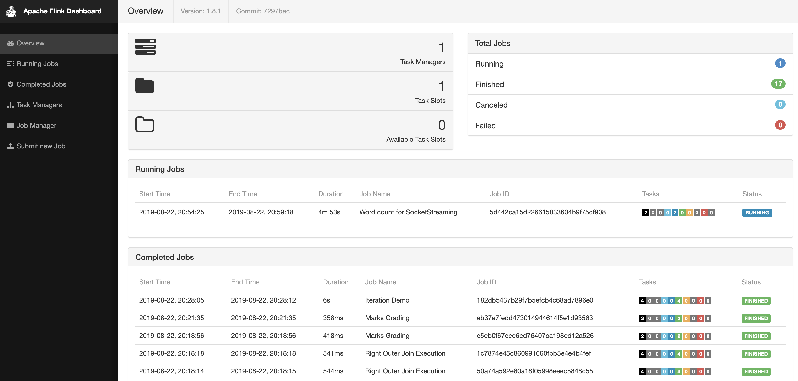
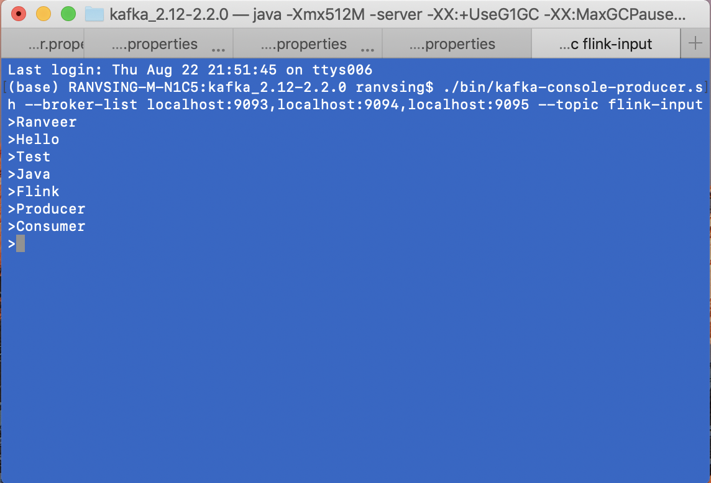
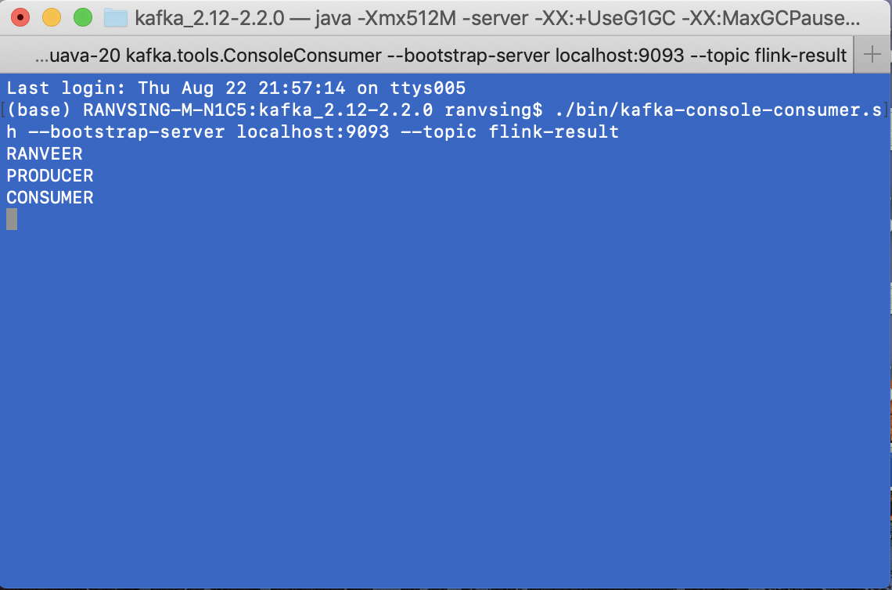
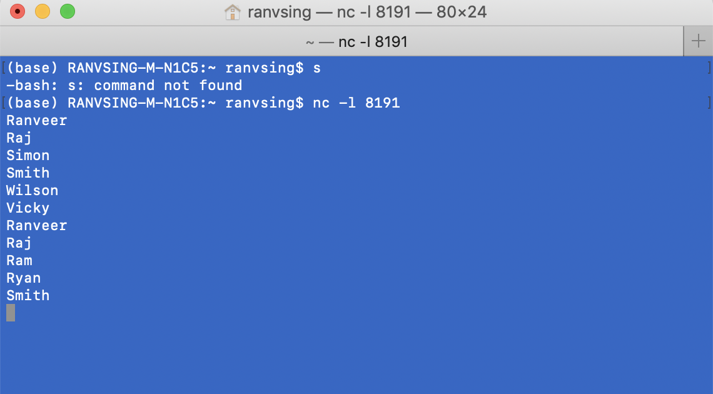
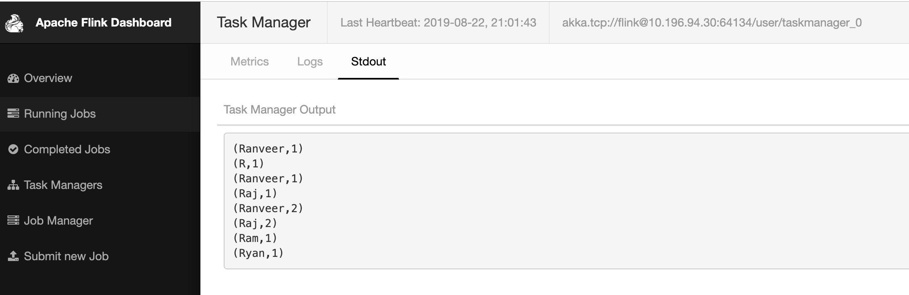

# Flink Stream Processor

Apache Flink is an open source platform which is a streaming data 
flow engine that provides communication, fault-tolerance, and 
data-distribution for distributed computations over data streams.

This project contains code regarding stream,join of data coming from various 
sources, such as file,socket & kafka.

Installation : 
Flink (1.8.1):  https://flink.apache.org/downloads.html#apache-flink-181 
Kafka (2.1.1): https://kafka.apache.org/downloads 

Follow these documents for command in flink environment. 
https://ci.apache.org/projects/flink/flink-docs-stable/ops/cli.html

Follow these documents for setup kafka environment. 
https://www.sohamkamani.com/blog/2017/11/22/how-to-install-and-run-kafka/

#### Build Command:
    mvn clean install
 This command will create StreamProcessor-1.0.jar file in target directory. 
 This jar file will have all the dependencies within as we have set in pom.xml file.
 
#### Shell Script:
    FlinkClusterStart.sh/FlinkClusterStop.sh : 
        For start and stop flink cluster. After starting cluster all subpackage code will work.

    FlinkStreamJoin.sh :
        For running join subpackage classes with command. Use command 'all' to execute all the file 
        in join subpackage. Other commands are inner, leftouter, outer, rightouter.
    
        For ex:
            ./FlinkStreamJoin.sh leftouter

    FlinkStreamConnector.sh : 
        For running stream subpackage classes with command. Various command available for running stream like 
        split,socket,kafka,salary,agg.
        
        For ex:
            ./FlinkStreamConnector.sh kafka
        
        

## Flink Cluster UI:
After starting flink cluster UI can be seen @http://localhost:8081/.

#### Dashboard: 
Contains details related to all the running,finished,cancelled and failed application.  
 
    
## 1. Connector :
This subpackage consists of code processing live data coming from file,socket or kafka. 
This will make changes in incoming data and perform operation like filtering, grouping 
and writing the generated report in either file, or in kafka. Their various api available
to store the data in various cloud storage DB. 

##### Command used for creating kafka cluster.
    Start Zookeeper:
    —————————-------
    ./bin/zookeeper-server-start.sh config/zookeeper.properties
    
    Start Broker/Server
    ———————————--------
    ./bin/kafka-server-start.sh config/server.1.properties
    ./bin/kafka-server-start.sh config/server.2.properties
    ./bin/kafka-server-start.sh config/server.3.properties
    
    Create producer/consumer topic 
    ———————————--------------------
    ./bin/kafka-topics.sh --create --topic flink-input --zookeeper localhost:2181 --partitions 3 --replication-factor 2  
    ./bin/kafka-topics.sh --create --topic flink-result --zookeeper localhost:2181 --partitions 3 --replication-factor 2
    
    Create Procedure
    ————————————----
    ./bin/kafka-console-producer.sh --broker-list localhost:9093,localhost:9094,localhost:9095 --topic flink-input
    
    Create Consumer
    —————————————-
    ./bin/kafka-console-consumer.sh --bootstrap-server localhost:9093 --topic flink-result
    
-->Link provided above for detailed description of command used for kafka.
   

 
    
Code Description : Click here for more details

#### KafkaStreamConProd.java :
    contains logic for reading from kafka topic "flink-input" by connecting to one of the kafka 
    nodes localhost:9093. After filtering only words longer than 5 and converting to Uppercase
    Pushing the data again to another kafka topic "flink-result" in node localhost:9093, we could 
    have used any nodes for publishing the data into kafka
    
Kafka producer console(flink-input): 
 
Kafka consumer console(flink-result): 
 

#### SocketStreamWordCount.java :
    contains logic for connecting flink to socket after opening socket using cmd:"nc -l 8191" 
    then prints the word typed along with count. We are only considering words starting from "R",
    we are filtering out all the other using filter method. 
Input in websocket after connecting port:8191 
 
Output in logs can be seen: 
 

#### StreamAgeGroupSalaryAnalyser.java :
    contains logic for dividing the salary data into age group, then calculate the average salry of each group.
    map and reduce used for calculating the result and producing output file.  

#### StreamAggregation.java : 
    contains logic for calulating the min,max,sum,minBy,maxBy based on the group. keyBy() method of DataStream used for
    grouping the data, and above described method used for performing operation on group basis. In ouput we will see 
    complete list of data, but last value in the group will have the latest calculated data.
    The difference between min and minBy is that min returns the minimum value, whereas minBy returns
    the element that has the minimum value in this field (same for max and maxBy)

#### StreamDataSpliter.java : 
    contains logic for dividing the passed data into various other files based on 
    the marks obtained by student. 3 files as output will get created distiction,
    pass & fail.  Command :  ./FlinkStream.sh split 
    

## 2.  Operator :
Operators transform one or more DataStreams into a new DataStream. Programs can combine multiple transformations into 
sophisticated dataflow topologies.

 

Description : Click here for more details

### 2.1 Event Time :
This subpackage consist of code generating data for live streaming on the port, in different types of event form like 
eventtime, processingtime. These generated data will be used by window subpackage for using data in different types 
of windows. i.e tumbling, sliding, session & global.

 

Description : Click here for more details

#### Processing time : 
    Processing time refers to the system time of the machine that is executing the respective operation.
#### Event time : 
    Event time is the time that each individual event occurred on its producing device. This time is typically embedded 
    within the records before they enter Flink, and that event timestamp can be extracted from each record.
#### Ingestion time: 
    Ingestion time is the time that events enter Flink. At the source operator each record gets the source’s current 
    time as a timestamp, and time-based operations (like time windows) refer to that timestamp.

### Watermarks :     
The mechanism in Flink to measure progress in event time.Watermarks flow as part of the data stream and carry a 
timestamp t. A Watermark(t) declares that event time has reached time t in that stream, meaning that there should 
be no more elements from the stream with a timestamp t’ <= t (i.e. events with timestamps older or equal to the watermark).

#### Timestamp Assigners / Watermark Generators :
    Timestamp assigners take a stream and produce a new stream with timestamped elements and watermarks. If the original
    stream had timestamps and/or watermarks already, the timestamp assigner overwrites them

#### Periodic Watermarks :
    AssignerWithPeriodicWatermarks assigns timestamps and generates watermarks periodically (possibly depending on the 
    stream elements, or purely based on processing time).

#### Punctuated Watermarks :
    To generate watermarks whenever a certain event indicates that a new watermark might be generated, use 
    AssignerWithPunctuatedWatermarks.
    
Note :  Flink comes with some pre-implemented timestamp assigners. AscendingTimestampExtractor: for periodic watermark 
generation is the case where timestamps seen by a given source task occur in ascending order.
BoundedOutOfOrdernessTimestampExtractor : for an argument the maxOutOfOrderness, i.e. the maximum amount of time an 
element is allowed to be late before being ignored when computing the final result for the given window. Lateness 
corresponds to the result of t - t_w, where t is the (event-time) timestamp of an element, and t_w that of the previous 
watermark. If lateness > 0 then the element is considered late and is, by default, ignored when computing the result of 
the job for its corresponding window.
For more details visit : https://ci.apache.org/projects/flink/flink-docs-master/dev/event_time.html

##### Note :
For more details visit : https://ci.apache.org/projects/flink/flink-docs-stable/dev/event_time.html

    
### 2.2 Join :
This subpackage consist of code doing task just like join does in SQL, code will be used to 
join the data available in the file. Here file will be working as a table
consist of huge data. In this we will have InnerJoin, OuterJoin, LeftOuterJoin,
RightOuter join.

 

#### InnerJoin : 
    consist of all common data in two files based on joining column(just like WHERE join clause).
#### OuterJoin :
    consist of all data both files are integrated together either they are matched or not.
#### LeftOuterJoin :
    consist of all data matching between two files and all the left file data.
#### RightOuterJoin :
    consist of all data matching between two files and all the right file data.

Note: We have 2 .txt file, timezone.txt file contains id,timezone and 
timezonesecretcode.txt contains id,secreatcode. Files in join subpackage will work on
all the above explained scenario.

### 2.3 Window :
This subpackage consists of code processing the request coming form socket or stream-processing tools in different 
types of windows. Windows are at the heart of processing infinite streams. Windows split the stream into “buckets” 
of finite size, over which we can apply computations A WindowAssigner is responsible for assigning each incoming 
element to one or more windows. Flink comes with pre-defined window assigners for the most common use cases, namely 
`tumbling windows, sliding windows, session windows and global windows`.

 

Description : Click here for more details

#### Tumbling Window :
    divide incoming data stream in non-overlapping group or window based on rules like timestamp ,element counts, 
    a combination of counts and time, or some custom logic to assign elements to window. In window() method we pass
    window size, which makes sure to evaluate current window after set time.
    
#### Sliding Windows :
    divide incoming data just like tumbling, but only difference between twos are data can be overlapping in group 
    or window. In window() method we pass window size and slide values parameter controls how frequently a sliding
    window is started. Sliding windows can be overlapping if the slide is smaller than the window size.

#### Session Windows :
    divide incoming data toa window based on time of incoming data, window get closed when data is not coming 
    for the certain period of time i.e., when a gap of inactivity occurred. This window doesn't overlap and doesn't 
    have fixed start or end time. When current window expires, new data will get added to new window.
Note: Dynamic gaps are specified by implementing the SessionWindowTimeGapExtractor interface.
Since session windows do not have a fixed start and end, they are evaluated differently than tumbling and sliding 
windows. Internally, a session window operator creates a new window for each arriving record and merges windows 
together if they are closer to each other than the defined gap. In order to be mergeable, a session window operator
requires a merging Trigger and a merging Window Function, such as ReduceFunction, AggregateFunction, or
ProcessWindowFunction (FoldFunction cannot merge.)

#### Global Windows :
    divide the incoming data into windows based on key, for using this custom trigger method need to be written. 
    Otherwise no computation will be perfomed.
    
### Window Functions :
This group of function are used for computation of data assigned to window. Once window get ready for processing one
of the function `ReduceFunction, AggregateFunction, FoldFunction or ProcessWindowFunction` 

 

Description : Click here for more details

#### ReduceFunction :
    T reduce(T var1, T var2) : combined two passed parameter of same type to produce an output element of the same type.

#### AggregateFunction :
    generalised version of ReduceFunction. consist of an input type (IN), accumulator type (ACC), and an output
    type (OUT) parameter. Used for aggregation logic implementation.

#### FoldFunction :
     input element of the window is combined with an element of the output type. The FoldFunction is incrementally 
     called for each element that is added to the window and the current output value.
 Note: fold() cannot be used with session windows or other mergeable windows.
 
#### ProcessWindowFunction :
    consist of all the element of window in iterator object, which will be used for processing the data. This class 
    has extra details like  Context object with access to time and state information, which enables it to provide more
    flexibility than other window functions.  This comes at the cost of performance and resource consumption, because 
    elements cannot be incrementally aggregated but instead need to be buffered internally until the window is
    considered ready for processing.
    
Note: 
1. The key parameter is the key that is extracted via the KeySelector that was specified for the keyBy() invocation. 
   In scenario of tuple as key, we need to extract the correct value from tuple for setting as key.   
2. A ProcessWindowFunction can be combined with either a ReduceFunction, an AggregateFunction, or a FoldFunction to
   incrementally aggregate elements as they arrive in the window.  

 

### 2.3.1 Trigger :
A Trigger determines when a window (as formed by the window assigner) is ready to be processed by the window function.
Each WindowAssigner comes with a default Trigger. If the default trigger does not fit your needs, you can specify a 
custom trigger using trigger(...).

 

Description : Click here for more details

The trigger interface has five methods that allow a Trigger to react to different events:

    onElement(): called for each element that is added to a window.
    onEventTime(): called when a registered event-time timer fires.
    onProcessingTime(): called when a registered processing-time timer fires.
    onMerge(): for stateful triggers and merges the states of two triggers when their corresponding windows merge, 
                e.g. when using session windows.
    clear(): for performs any action needed upon removal of the corresponding window.

The first three decide how to act on their invocation event by returning a TriggerResult. The action can be one of the following:
    
    CONTINUE: do nothing,
    FIRE: trigger the computation, keeps the contents of the window,
    PURGE: clear the elements in the window, and
    FIRE_AND_PURGE: trigger the computation and clear the elements in the window afterwards.

 
#### Default Triggers of WindowAssigners
The default Trigger of a WindowAssigner is appropriate for many use cases. For example, all the event-time window 
assigners have an EventTimeTrigger as default trigger. This trigger simply fires once the watermark passes the end of a window.

Note:
1. Attention The default trigger of the GlobalWindow is the NeverTrigger which does never fire. Consequently, you always 
have to define a custom trigger when using a GlobalWindow.
2. Attention By specifying a trigger using trigger() you are overwriting the default trigger of a WindowAssigner. 
For example, if you specify a CountTrigger for TumblingEventTimeWindows you will no longer get window firings based on 
the progress of time but only by count. Right now, you have to write your own custom trigger if you want to react based 
on both time and count.

#### Built-in and Custom Triggers
Flink comes with a few built-in triggers.

    -The (already mentioned) EventTimeTrigger fires based on the progress of event-time as measured by watermarks.
    -The ProcessingTimeTrigger fires based on processing time.
    -The CountTrigger fires once the number of elements in a window exceeds the given limit.
    -The PurgingTrigger takes as argument another trigger and transforms it into a purging one.

### 2.3.2 Evictors :
The evictor has the ability to remove elements from a window after the trigger fires and before and/or after the window
function is applied

 

Description : Click here for more details

    
    //contains the eviction logic to be applied before the window function,
    void evictBefore(Iterable<TimestampedValue<T>> elements, int size, W window, EvictorContext evictorContext);
    
    //contains the one to be applied after the window function
    void evictAfter(Iterable<TimestampedValue<T>> elements, int size, W window, EvictorContext evictorContext);

Flink comes with three pre-implemented evictors. These are:
##### CountEvictor :
keeps up to a user-specified number of elements from the window and discards the remaining ones from the beginning of
 the window buffer.
 
##### DeltaEvictor :
takes a DeltaFunction and a threshold, computes the delta between the last element in the window buffer and each of the 
remaining ones, and removes the ones with a delta greater or equal to the threshold.

##### TimeEvictor : 
takes as argument an interval in milliseconds and for a given window, it finds the maximum timestamp max_ts among its 
elements and removes all the elements with timestamps smaller than max_ts - interval.

Note :
1. Specifying an evictor prevents any pre-aggregation, as all the elements of a window have to be passed to 
the evictor before applying the computation.

2. Attention Flink provides no guarantees about the order of the elements within a window. This implies that although 
an evictor may remove elements from the beginning of the window, these are not necessarily the ones that arrive first 
or last.

##### Note :
For more details visit : https://ci.apache.org/projects/flink/flink-docs-stable/dev/stream/operators/windows.html

 
    
Code Description : Click here for more details

#### GlobalWindow.java :
    contains logic for creating the global window for the passed data in websocket.  trigger() set as CountTrigger, 
    whenever the count reaches the value event processed. To run this event subpackgae event 
    SessionWindowProcessingTimeProducer.java used for creating the input, then run this main method. In result we will 
    see the calculated output for each window.
#### SessionEventTimeWindow.java :
    contains logic for creating the session window bases on event time for the passed data in websocket.  
    assignTimestampsAndWatermarks(), here we are using the first parameter for setting the timestamp. To run this 
    subpackgae event SessionWindowEventTimeProducer.java class used for creating the input first, then run this main method.
    In result we will see the calculated output for each window. 
#### SessionProcessingTimeWindow.java :
    contains logic for creating the session window based on processing time set while performing the operation.To run this
    subpackgae event SessionWindowProcessingTimeProducer.java class used for creating the input first, then run this 
    method. In result we will see the calculated output for each window. 
#### SlidingEventTimeWindow.java :
    contains logic for creating the window based on set timestamp for window and sliding in windowAll() method. 
    assignTimestampsAndWatermarks() method used for setting the timestamp passed in data as watermark. To run this 
    subpackgae event SlidingTumblingEventTimeProducer.java class used for creating the input first, then run this method.
    In result we will see the calculated output for each window. 
#### SlidingProcessingTimeWindow.java :
    contains logic for creating the window based on processing time set while performing the operation. Window time duration 
    and sliding time is used for creating the window. To run this subpackgae event SlidingTumblingProcessingTimeProducer.java 
    class used for creating the input first,then run this method. In result we will see the calculated output for each window. 
#### TumblingEventTimeWindow.java :
    contains logic for creating the window with fixed size and based on timestamp passed from the producer in data 
    stream,To run this subpackgae event SlidingTumblingEventTimeProducer.java class used for creating the input first, 
    then run this method.In result we will see the calculated output for each window. 
#### TumblingProcessingTimeWindow.java :
    contains logic for creating the window with fixed size and based on based on processing time set while performing 
    the operation. To run this subpackgae event SlidingTumblingProcessingTimeProducer.java class used for creating the input first, 
    then run this method.In result we will see the calculated output for each window. 

##### Note:    
Use flink command to execute: `/usr/local/Cellar/apache-flink/1.8.1/bin/flink run -c com.flink.stream.window.TumblingProcessingTimeWindow target/StreamProcessor-1.0.jar`

### 2.6 State :

It is snapshot of application on particular time with information about past input and events.
Keyed State and Operator State exist in two forms: `managed` and `raw`.

 

Description : Click here for more details

#### Keyed State :
Keyed State is always relative to keys and can only be used in functions and operators on a KeyedStream.

##### Managed Key State :
    represented in data structures controlled by the Flink runtime, such as internal hash tables, or RocksDB. 
    Examples are “ValueState”, “ListState”, "ReducingState", "AggregatingState", "MapState" etc. Flink’s runtime encodes 
    the states and writes them into the checkpoints.

##### StateDescriptor :

 This holds the name of the state, the type of the values that the state holds, and possibly a user-specified function, 
 such as a ReduceFunction.Depending on what type of state you want to retrieve, you create either a ValueStateDescriptor, 
 a ListStateDescriptor, a ReducingStateDescriptor, a FoldingStateDescriptor or a MapStateDescriptor.
 
##### State Time-To-Live(TTL) :
A time-to-live (TTL) can be assigned to the keyed state of any type. If a TTL is configured and a state value has 
expired, the stored value will be cleaned up on a best effort basis.All state collection types support per-entry TTLs. 
This means that list elements and map entries expire independently.

##### Raw Key State :
    It is state that operators keep in their own data structures. When checkpointed, they only write a sequence of bytes 
    into the checkpoint. Flink knows nothing about the state’s data structures and sees only the raw bytes.

#### Operator State :
Operator State (or non-keyed state), each operator state is bound to one parallel operator instance. The Kafka Connector 
is a good motivating example for the use of Operator State in Flink. 

##### Managed Operator State :
To use managed operator state, a stateful function can implement either the more general CheckpointedFunction interface, 
or the ListCheckpointed<T extends Serializable> interface.

##### Checkpoints :
It allow Flink to recover state and positions in the streams to give the application the same semantics as a 
failure-free execution.checkpointing is disabled. To enable checkpointing, call enableCheckpointing(n) on the 
StreamExecutionEnvironment, where n is the checkpoint interval in milliseconds.
    
    exactly-once vs. at-least-once: mode to the enableCheckpointing(n) method to choose between the two guarantee levels
    checkpoint timeout: abort checkpointing if operation didn't finished in given time.
    minimum time between checkpoints:  set gap between two checkpointing. After the previous checkpoint completed, 
    regardless of the checkpoint duration and the checkpoint interval.
    number of concurrent checkpoints: to allow for multiple overlapping checkpoints, which is interesting for pipelines
    that have a certain processing delay  
    fail/continue task on checkpoint errors : if a task will be failed if an error occurs in the execution of the 
    task’s checkpoint procedure.
    prefer checkpoint for recovery: This determines if a job will fallback to latest checkpoint even when there are more 
    recent savepoints available to potentially reduce recovery time.

##### CheckpointedFunction :
The CheckpointedFunction interface provides access to non-keyed state with different redistribution schemes. 
It requires the implementation of two methods:

    void snapshotState(FunctionSnapshotContext context) throws Exception;
    
    void initializeState(FunctionInitializationContext context) throws Exception;

Whenever a checkpoint has to be performed, snapshotState() is called. The counterpart, initializeState(), is called 
every time the user-defined function is initialized, be that when the function is first initialized or be that when the 
function is actually recovering from an earlier checkpoint. Given this, initializeState() is not only the place where 
different types of state are initialized, but also where state recovery logic is included.

#### Broadcast State :
Broadcast introduced to support use cases where some data coming from one stream is required to be broadcasted to all 
downstream tasks, where it is stored locally and is used to process all incoming elements on the other stream.

##### Note :
For more details visit :: https://ci.apache.org/projects/flink/flink-docs-release-1.9/dev/stream/state/state.html

 
    
Code Description : Click here for more details

#### BroadcastImpl.java :
      contains logic for creating a broadcast stream for all the avilable node to use info for processing the incoming 
      stream of data. To use this class execute BroadcastProducer class in prodevent subpackage for creating the input 
      through websocket.
#### CheckPointStateImpl.java :
    consist logic for creating checkpoint with configuration details of all the stream, for making the system rigid in 
    case of failure while processing the stream. To use this class execute StateProducer class in prodevent subpackage 
    for creating input through websocket.
#### ListStateImpl.java :
    consist logic for creating List state for the incoming stream , process the list when threshold reached. Can append 
    elements and retrieve an Iterable over all currently stored elements To use this class execute StateProducer class 
    in prodevent subpackage for creating input through websocket.
#### ReduceStateImpl.java :
    consist logic for keeping a single value that represents the aggregation of all values added to the state.To use this 
    class in prodevent subpackage execute StateProducer class for creating input through websocket.
#### ValueStateImpl.java :
    consist logic for keeping a value that can be updated and retrieved.To use this class execute StateProducer class 
    in prodevent subpackage for creating input through websocket.
    
##### Note:    
Use flink command to execute: `/usr/local/Cellar/apache-flink/1.8.1/bin/flink run -c com.flink.stream.state.BroadcastImpl target/StreamProcessor-1.0.jar`

  

  

##### Note: 
    ->If Flink installation location different then,make path changes in all shell script files.
    ->All report will be generated in output folder.
    ->For running application use shell script statements provided abbove  
    
